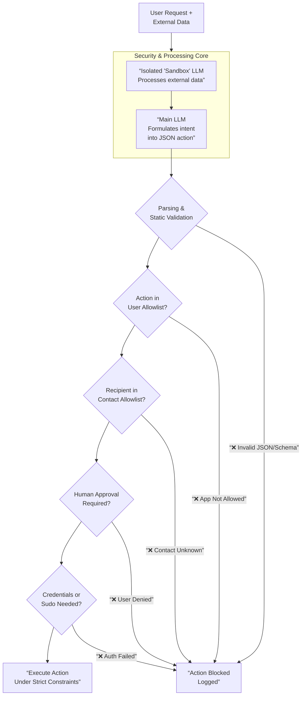

# Normbot 🤖

**A Security-First, Self-Hosted AI Agent**  
*Currently in active planning and development.*

Normbot is an open-source, self-hosted AI assistant built with one core principle: **maximize capability without compromising host system security**. It is inspired by the functionality of projects like moltbot (formerly clawdbot) but architected from the ground up with a different security philosophy.

> **⚠️ Disclaimer: This project is in its earliest planning stage.** This document outlines the proposed architecture and security model. Code will be developed incrementally based on this blueprint. Contributions and discussions are welcome.

## Quick Update (Feb 2025)

After careful consideration, I've decided to pivot from building custom skills to leveraging n8n as Normbot's primary action engine. Rather than wrestling with designing a generic skill interface that balances flexibility with security constraints—an undertaking that could delay the project indefinitely, I'm integrating n8n directly, which provides immediate access to 400+ battle-tested integrations out of the box. This approach mirrors OpenClaw's capabilities while maintaining Normbot's security-first architecture: n8n workflows will be defined on-demand by the main LLM, validated against strict JSON schemas and user allowlists and executed through a controlled orchestration layer that manages credentials from Normbot's encrypted vault. By offloading integration complexity to n8n, I can focus engineering effort on the core security layers—approval workflows, credential isolation, and audit logging, While retaining the ability for Normbot to dynamically generate new capabilities as needed without manual skill development.

## 🛡️ Core Security Philosophy: Containment, Not Just Filtering

The prevailing approach to AI agent security often focuses on **filtering** or **detecting** malicious inputs (like prompt injection). Normbot adopts a different strategy: **assume that any data from the outside world (emails, web pages) is potentially hostile, and architect the system to neutralize its effects.**

Instead of trying to perfectly prevent malicious prompts from entering the system, Normbot's layers of defense ensure that even if they do, they **cannot cause harm**. This is achieved through strict action validation, mandatory approvals for risky operations and complete system isolation for untrusted data processing.

## 🏗️ Proposed Architecture & Defense Layers

The security of Normbot is designed as a series of concentric barriers. For an action to be executed, it must pass through all required layers.

### **1. JSON Schema Action Protocol**
The LLM does **not** have system control. Its sole output must be a JSON object matching a strict predefined schema.
*   **Example:** `{"action": "exec", "app": "mail", "task": "send", "details": {...}}`
*   **Validation:** The backend parses this JSON. If parsing fails, the action is discarded. It then checks if the `app` and `task` exist in the user's **personal allowlist**.

### **2. Human-in-the-Loop Approval**
For any action with real-world impact (sending mail, making a purchase, deleting files) Normbot will send a confirmation request to the user via the connected messaging app (e.g., Telegram).
*   **Granular Control:** The approval policy will be configurable per-action type via the **User Dashboard**.

### **3. Contact & Recipient Allowlist**
The agent can only interact with pre-vetted external entities.
*   **Example:** To send an email to `new@contact.com` the user must first add this address to their contact list via the **User Dashboard**. This prevents data exfiltration and spam.

### **4. Sudo-like Master Authentication**
Sensitive system-wide changes (e.g., installing software, changing core settings) require a separate master password provided interactively within the chat.

### **5. Encrypted Credential Vault**
API keys, passwords and payment details are **never stored in plaintext**.
*   **Method:** Credentials are encrypted with AES-256.
*   **Access:** The master key is held separately (e.g., in the OS keychain). When a task requires a credential, the user is prompted for the master key via chat, which decrypts the credential for a single use in memory.

### **6. Isolated "Sandbox" LLM Instance**
This is kind of key innovation (or atleast i don't find any similar approach) to neutralize prompt injection from external data.
*   **Function:** A separate, lightweight LLM instance **with no system access, no memory and no ability to trigger actions** is used **solely** to summarize emails, web pages or documents.
*   **Result:** Only the clean summary is passed to the main LLM. Any malicious instructions hidden in the source material are trapped in the sandbox.

### **7. User Dashboard: Centralized Control**
Every allowlist (apps, contacts, websites) and security policy (auto-approvals, sudo settings) is managed through a simple web-based **User Dashboard**. This gives the user transparent, granular control over their agent's capabilities.

## 🔮 Future/Planned Security Features

*   **Docker-Based Code Execution:** Any code written or reviewed by the agent will be executed inside ephemeral, resource limited Docker containers.
*   **Test-Driven Development (TDD) Sandbox:** Code must pass a security focused test suite within the container before any output is accepted, preventing logic bombs and exploits.

## Security vs. Convenience

Normbot's design intentionally makes conscious trade-offs:

*   **Friction:** Mandatory confirmations and allowlist management add steps compared to a fully autonomous agent. We view this as a **necessary feature** not a bug. It ensures the user remains in control.
*   **Complexity:** Configuration via a dashboard and multiple security layers requires more initial setup than simpler agents. The goal is to make this process as intuitive as possible.
*   **Philosophy:** This project prioritizes **security and user sovereignty** above total automation. It is designed for users who want powerful AI assistance but are unwilling to compromise the security of their personal systems and data.

## 🚀 Getting Started (Planned)

Normbot is not yet functional. Development will follow this plan:

1.  **Phase 1:** Core JSON schema parser, allowlist manager, and basic CLI prototype.
2.  **Phase 2:** Integration with a messaging app (Telegram) and the approval system.
3.  **Phase 3:** Development of the User Dashboard and credential vault.
4.  **Phase 4:** Implementation of the sandboxed LLM and Docker execution environments.

**Stay tuned.** When a minimal viable prototype is ready, installation instructions will appear here.

## 📄 License

This project will be released under an open-source license (likely MIT or AGPLv3). The specific license will be chosen before the first public code release.

---

**Normbot is a project born from the belief that powerful, personal AI should be safe, controllable and private by design.**
